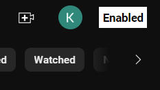
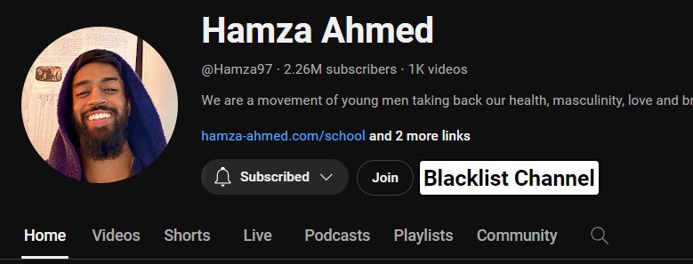
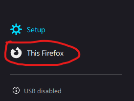
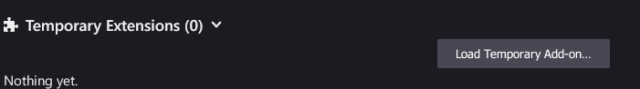
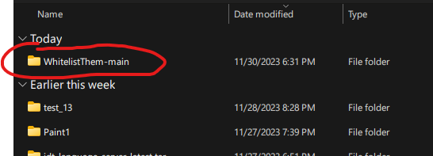
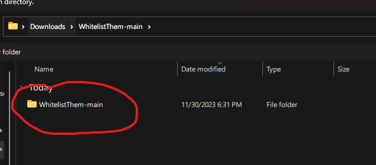

# WhitelistThem

> A productive solution to Youtube 

WhitelistThem is a chrome extension that aims to whitelist certain channels into popping up on your Home Page and Recommendations. 

# Usage

After installing WhitelistThem (currently only available through this GitHub Repo), you will immediately be introduced to the plugins simple Modifications. 

### Home Page

> As of 12/7/2023, the plugin is set to be automatically on by default.

All the videos that pop up on your homepage `https://youtube.com/`, will contain a `+` or a `-` in the top left of the thumbnail. Clicking the `+` will insert the channel into the whitelist and the `-` does the vice versa.

You can enable the filtering by clicking on the White Box in the top right of YouTube right next to your avatar. The changes are immediate so there's no reason to refresh.

> **NOTE**: YouTube Shorts are hidden by default, If anyone wants to commit a feature where YouTube Shorts can be toggled on or off separately then be my guest because I find no productive use in YouTube Shorts. 

### Video

> There is a bug where sometimes you can't add channels through recommendations.

All the videos you may get recommended while you watch a video (`https://youtube.com/watch?=`) are also filtered. The same `+` / `-` mechanic is available on the recommended videos.

### Channel

> There is a state bug where you must refresh between channels, this will be fixed very soon but as of now, refresh your browser every time you navigate to a Channel

Every channel (`https://youtube.com/@any`) you visit will be pure and you can watch their videos despite them being Whitelisted or not, however there will be an option right next to their channel name (another white box) to either whitelist or blacklist them.

# Installation

> This will be how to install the GitHub(most latest) version to your browser; as of *12/7/23*, this is the only way to install WhitelistThem.

## Extract

First Clone this repo or click the Green `Code` button in the top right of this repo and click `Download ZIP` and then extract the file into it's own folder, you're going to have a folder inside your extraction, this folder is named `WhitelistThem-main`, this `WhitelistThem-main` folder will be where you will tell FireFox to import the plugin.

## Enable Developer Mode

Open a new tab on FireFox and type in the following into the URL/Search Bar: 

> `about:debugging`

Once there, you are going to see a menu to the left, click on the tab `This Firefox` 

After clicking the tab, You should see a field **Temporary Extensions** 

## Install the Extension

Click on the button Load Temporary Add-on and it should show you a file explorer, lead yourself to the folder you extracted, and open it. Make sure you import the `WhitelistThem-main` nested inside the extracted folder, otherwise it will not work.

> If you encounter an error where a `manifest.json` file is missing, try searching a folder that contains `manifest.json` and `./src`

Click done, and the plugin is installed